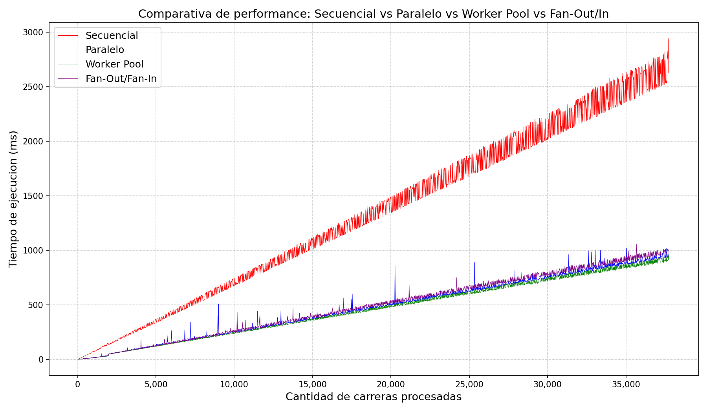
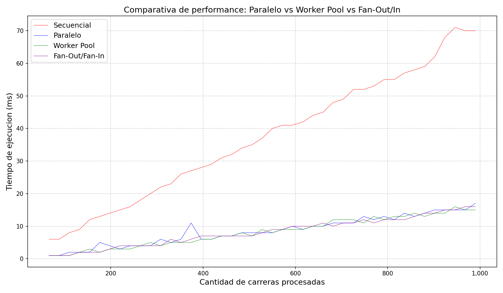

[README.md](https://github.com/user-attachments/files/28572583/README.md)
# Golang Performance Benchmark — F1 Edition


Benchmark of four concurrency models in Go — sequential, parallel (goroutine per race), worker pool, and fan-out/fan-in — applied to real Formula 1 2025 season data. The project measures how each approach scales as the number of processed races grows, and visualizes the results using Python and Matplotlib.

---

## Table of Contents

- [Description](#description)
- [Visuals](#visuals)
- [Installation](#installation)
- [Usage](#usage)
- [Project Structure](#project-structure)
- [Roadmap](#roadmap)
- [Contributing](#contributing)
- [Authors](#authors)
- [License](#license)

---

## Description

The goal of this project is to compare the real-world performance of different concurrency patterns in Go when processing large volumes of data.

Starting from a real F1 2025 dataset (`carreras.json`), the program synthetically generates additional seasons to scale the workload — from a few dozen races up to tens of thousands — and benchmarks four processing strategies:

- **Sequential** — baseline, single-threaded processing
- **Parallel** — one goroutine per race, synchronized with a `sync.Mutex`
- **Worker Pool** — fixed number of workers consuming from a channel queue
- **Fan-Out / Fan-In** — explicit channel pipeline: work is distributed (fan-out) and results are collected (fan-in) without mutex

For each race and driver, the following metrics are computed:
- Average lap time
- Consistency (standard deviation of lap times)
- Worst lap time
- Best driver per team (by consistency index)

Points are assigned using the official F1 scoring system (25-18-15-12-10-8-6-4-2-1 for the top 10).

Results are written to CSV files and then plotted with Python.

---

## Visuals

### Full benchmark — all races



Sequential processing grows linearly and significantly slower than the parallel approaches. Beyond ~5,000 races the gap is clear, reaching nearly **3x slower** than concurrent methods at 35,000+ races.

### Filtered view — first 1,000 races



With a small number of races, the goroutine overhead isn't amortized yet and the difference between sequential and parallel is minimal. Worker Pool and Fan-Out/Fan-In behave almost identically in this range.

### Worker Pool — workers analysis (1–8)


With 1 worker, the Worker Pool behaves almost sequentially. Average time drops considerably going from 1 to 4 workers, consistent with the number of logical cores available. Beyond 6–8 workers, gains become marginal.

---

## Installation

### Requirements

- [Go 1.21+](https://go.dev/dl/)
- [Python 3.10+](https://www.python.org/downloads/)
- Python dependencies: `pandas`, `matplotlib`

### Steps

**1. Clone the repository**
```bash
git clone https://github.com/Emiliano-Etcheverry/golang-performance-benchmark.git
cd golang-performance-benchmark
```

**2. Install Python dependencies**
```bash
pip install pandas matplotlib
```

---

## Usage

### Run the Go benchmark

```bash
cd go
go run .
```

This will process the races across all configured year ranges and worker counts, printing progress to stdout and writing results to:
- `data/tiempos.csv` — timing results for all four strategies
- `data/workers.csv` — timing results per worker count

Expected output example:
```
Carreras: 100 | Workers: 1 | Tiempo: 12ms
Carreras: 100 | Workers: 2 | Tiempo: 8ms
...
```

### Generate the graphs

```bash
cd python
python performance.py
python performance_filtrado.py
python performance_workers.py
```

Graphs are saved to the `graphs/` folder.

### Configuring the benchmark

In `go/main.go` you can adjust:

```go
// Year range to generate synthetic seasons
for anioFin := 2026; anioFin <= 3024; anioFin += 1 {

// Number of workers to test
cantidadWorkers := []int{1, 2, 3, 4, 5, 6, 7, 8}
```

---

## Project Structure

```
golang-performance-benchmark/
├── go/
│   ├── main.go          # Entry point and benchmark loop
│   ├── modelos.go       # Data structures (Piloto, Carrera, ResultadoPiloto)
│   ├── datos.go         # JSON data loading
│   ├── algoritmos.go    # Core computation (times, consistency, points, season generation)
│   ├── secuencial.go    # Sequential processing
│   ├── paralelo.go      # Parallel processing (goroutine per race)
│   ├── workerPool.go    # Worker pool pattern
│   └── fanInOut.go      # Fan-Out / Fan-In pattern
├── python/
│   ├── performance.py           # Full comparative chart
│   ├── performance_filtrado.py  # Filtered chart (first 1,000 races)
│   └── performance_workers.py   # Workers analysis chart
├── data/
│   ├── carreras.json    # Real F1 2025 dataset
│   ├── tiempos.csv      # Benchmark results (strategies)
│   └── workers.csv      # Benchmark results (workers)
├── graphs/
│   ├── comparativa_performance.png
│   ├── comparativa_performance_filtrado.png
│   └── comparativa_workers.png
└── README.md
```

---

## Roadmap

- [ ] Add benchmark for `errgroup` concurrency pattern
- [ ] Add CPU and memory profiling with `pprof`
- [ ] Interactive visualization dashboard (e.g. with Plotly or Streamlit)
- [ ] Configurable benchmark parameters via CLI flags instead of hardcoded values
- [ ] Add support for multiple runs per configuration and report averages + standard deviation

---

## Author

**Emiliano Etcheverry**
- [Portfolio](https://emiliano-etcheverry.github.io/emiliano.etcheverry-portfolio)

---

## License

This project is licensed under the [MIT License](https://choosealicense.com/licenses/mit/).
